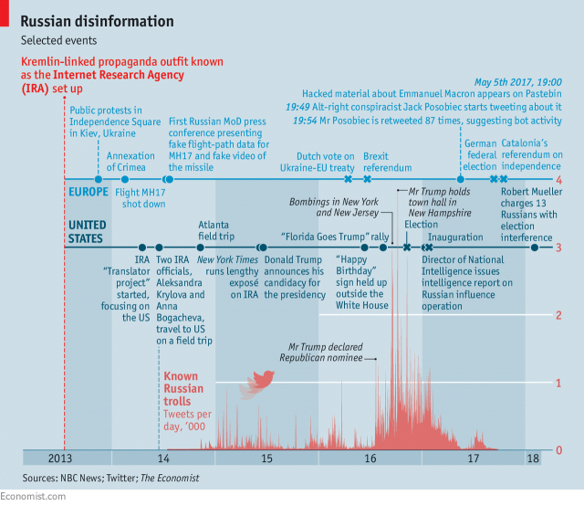

```{r setup, include=FALSE}
knitr::opts_chunk$set(echo = TRUE, warning=FALSE, message=FALSE)
```

## Russian Trolls

Last week, [NBC released a dataset of over 200,000 Russian troll tweets](https://www.nbcnews.com/tech/social-media/now-available-more-200-000-deleted-russian-troll-tweets-n844731); for more information, see [Economist](https://www.economist.com/news/leaders/21737276-and-why-wests-response-inadequate-how-putin-meddles-western-democracies) and [New York Times Daily Podcast](https://www.nytimes.com/2018/02/21/podcasts/the-daily/facebook-russia-trump.html?rref=collection%2Fbyline%2Fmichael-barbaro&action=click&contentCollection=undefined&region=stream&module=stream_unit&version=latest&contentPlacement=3&pgtype=collection)).



I'll use the `tidyverse` (via `readr`) package to import the flat files (csv's).

```{r data}
library(tidyverse)

url <- "http://nodeassets.nbcnews.com/russian-twitter-trolls/tweets.csv"
tweets <- read_csv(url)

user.url <- "http://nodeassets.nbcnews.com/russian-twitter-trolls/users.csv"
users <- read_csv(user.url)
```

### Who are they?

```{r}
tweets %>%
  count(user_key, sort = TRUE) %>%
  mutate(percent = n / sum(n)) %>%
  head(n = 10)
```

```{r}
users %>%
  arrange(desc(followers_count)) %>%
  select(screen_name, name, location, followers_count) %>%
  head(n = 10)
```

Some clearly had ties to Russia, while others posed as media outlets or individuals.

Let's examine Jenn_Abrams (see [the Guardian article](https://www.theguardian.com/technology/shortcuts/2017/nov/03/jenna-abrams-the-trump-loving-twitter-star-who-never-really-existed)).

```{r}
tweets %>%
  filter(user_key == "jenn_abrams") %>%
  group_by(Date = as.Date(created_str)) %>%
  summarise(Count=n()) %>%
  ggplot(aes(x = Date, y = Count)) +
  geom_line() +
  labs(title = "@jenn_abrams Tweets",
       x = "Day",
       y = "Number of Tweets")
```

### What were the top tweets by retweet and favorite (likes) counts?

```{r}
tweets %>%
  arrange(desc(retweet_count)) %>%
  select(user_key, created_str, text, retweet_count) %>%
  head(n=10)
```

```{r}
tweets %>%
  arrange(desc(favorite_count)) %>%
  select(user_key, created_str, text, favorite_count) %>%
  head(n=10)
```

New highly infamous trolls pop up like [@crystal1johnson](https://tweetsave.com/crystal1johnson) (who even [Twitter CEO Jack Dorsey retweeted](https://arstechnica.com/gaming/2017/10/report-twitter-ceo-took-a-russian-impostors-bait-in-2016/)) or @ten_gop, see [Vox](https://www.vox.com/policy-and-politics/2017/10/19/16504510/ten-gop-twitter-russia)
or [CNN](https://www.cnn.com/2018/02/16/politics/who-is-ten-gop/index.html).

### Plotting tweets over time

A good start is to plot the number of tweets by date. We'll use `ggplot2`

```{r}
tweets %>%
  count(Date = as.Date(created_str)) %>%
  ggplot(aes(x = Date, y = n)) +
  geom_line() +
  labs(title = "Tweets by Known Russian Twitter Trolls",
       x = "Day",
       y = "Number of Tweets")
```

What's clear is that their activity started back in 2014 but really started to pick up around mid 2016, averaging hundreds to thousands of tweets per day.

Let's see the trends by counting the number of tweets that contain politically related terms.

```{r}
tweets$trump <- grepl("trump", tweets$text, ignore.case = TRUE)
tweets$obama <- grepl("obama", tweets$text, ignore.case = TRUE)
tweets$clinton <- grepl("clinton", tweets$text, ignore.case = TRUE)

tweets %>%
  mutate(term = 
    case_when(
      trump + clinton + obama > 1 ~ "Multiple",
      trump == TRUE ~ "Trump",
      clinton == TRUE ~ "Clinton",
      obama == TRUE ~ "Obama"
    )) %>%
  filter(!is.na(term)) %>%
  count(Date = as.Date(created_str), term) %>%
  ggplot(aes(x = Date, y = n, color = term)) + 
  geom_line() +
  facet_wrap(~term, ncol = 2) +
  labs(title = "Russian Troll Tweets by Mentioned Terms",
       y = "Tweet Count") +
  theme(legend.position = "none")
```


### Text analysis

To analyze the text, I'm using [`quanteda`](http://docs.quanteda.io/), which is my go-to text analysis package (anywhere). However, another great package that's easier for beginners is [`tidytext`](https://www.tidytextmining.com/). I simply choose `quanteda` because of its speed and versalility, but `tidytext` has a lot to offer as well. I will however use `tidytext` near the end to analyze my topic model results.

Let's load `quanteda` and create a corpus as well as keeping the users' screen_name (handle) on as a corpus feature.

```{r text}
library(quanteda)

corpus <- corpus(tweets$text)
docvars(corpus, "screen_name") <- tweets$user_key
```

Next, we'll do basic pre-processing to create the dfm (document-feature matrix), that is the core datastructure to keep our document-term matrix and corpus feature in a very efficient sparse matrix.

I trimmed terms that are not in the dataset at least 10 times or in at least 5 tweets (somewhat arbitrary but important to remove very rare/sparse terms).

```{r}
stopWords <- c("t.co","http","https","amp","t","t.c","c","rt")

dfm <- dfm(corpus,
           remove = c(stopwords("english"), stopWords),
           ngrams= 1L,
           stem = F,
           remove_numbers = TRUE, 
           remove_punct = TRUE,
           remove_symbols = TRUE) %>%
  dfm_trim(min_count = 10, min_docfreq = 5)
```

Let's look at the top words used.

```{r}
topfeatures(dfm, n = 50)
```

It's clear that the top terms used are related to "trump", "hillary", "clinton", and "obama." This provides direct evidence that these trolls were discussing politically related topics.

### Hashtags

We can then use helpful functions to build a hashtag co-occurrence network.

For this, we'll run with the top 40 hashtags and create a network in which the nodes are hashatags and the edges are when the hashtags co-occurred in at least 10% of tweets.

```{r}
tag_dfm <- dfm_select(dfm, ('#*'))

# number of hashtags to show
top <- 40

topfeatures(tag_dfm, top) %>%
  head(n = top) 

# create co-occurrence matrix and network
fcm(tag_dfm) %>%
  fcm_select(names(topfeatures(tag_dfm, top))) %>%
  textplot_network(min_freq = 0.1, edge_alpha = 0.8, edge_size = 4)
```

### Handles

Similarly, we can do the same thing but for handles (screen_name) mentions.

```{r}
sn_dfm <- dfm_select(dfm, ('@*'))

# number of hashtags to show
top <- 25

topfeatures(sn_dfm, top) %>%
  head(n = top) 

# create co-occurrence matrix and network
fcm(sn_dfm) %>%
  fcm_select(names(topfeatures(sn_dfm, top))) %>%
  textplot_network(min_freq = 0.2, edge_alpha = 0.9, edge_size = 3)
```

### Retweet Network

```{r}
rts <- tweets[grep("RT @", tweets$text),]

names <- unique(rts$user_key)

edges <- tibble(node1 = rts$user_key, 
                node2 = gsub('.*RT @([a-zA-Z0-9_]+):? ?.*', rts$text, repl="\\1")) %>%
  filter(node1 %in% names & node2 %in% names) %>%
  group_by(node1, node2) %>%
  summarise(weights = n())

library(igraph)

g <- graph_from_data_frame(d=edges, directed=TRUE)

library(ggraph); library(ggnetwork); library(network)

ggplot(ggnetwork(g, weights = "Frequency"), aes(x = x, y = y, xend = xend, yend = yend)) +
  geom_edges(arrow = arrow(length = unit(3, "pt"), type = "closed"), color = "grey75") +
  geom_nodes(color = "gold", size = 8) +
  geom_nodetext(aes(label = LETTERS[ vertex.names ])) +
  theme_minimal() +
  theme(axis.text = element_blank(),
        axis.title = element_blank(),
        panel.background = element_rect(fill = "grey25"),
        panel.grid = element_blank())
```

### Topic Modeling

For this part, I'll run Correlated Topic Model using the `stm` package.

First, I'll need to convert my dfm to the stm data-structure.

```{r stm}
library(stm)

# use quanteda converter to convert our Dfm
stmdfm <- convert(dfm, to = "stm")

out <- prepDocuments(stmdfm$documents, 
                     stmdfm$vocab, 
                     stmdfm$meta, 
                     lower.thresh = 10)
```

Next, we'll run topic modeling, choosing 16 topics to simplify our models (there are a ton of great diagnostics for selecting the number of topics in `stm`. Check them out in its help documents!).

```{r stm-model, message=FALSE, warning=FALSE}
# k = 10 topic for simplicity
k <- 10

ctmFit <- stm(out$documents, out$vocab, K = k,
              max.em.its = 150, data = out$meta, init.type = "Spectral", seed = 300)

```

Next, let's use `tidytext` to analyze our results.

```{r fig.height=7}
# make sure its version 0.1.6 or higher of tidytext 
library(tidytext); library(ggridges)

# tidy the document-topic combinations, with optional document names
td_gamma <- tidy(ctmFit, matrix = "gamma",
                 document_names = stmdfm$meta$screen_name)

userList <- c("jenn_abrams","ten_gop","crystal1johnson",
              "maxdementiev","kadirovrussia","lavrovmuesli",
              "politweecs","washingtonline","neworleanson")

labels <- sageLabels(ctmFit, n = 4)
topicsNames <- sapply(1:10, function(x) paste0(labels$marginal$prob[x,], collapse = " + "))
topics <- tibble(topicsNames,
                 topicNum = 1:10)

td_gamma %>%
  filter(document %in% userList) %>%
  inner_join(topics, by = c("topic" = "topicNum")) %>%
  group_by(document, topic) %>%
  ungroup() %>%
  ggplot(aes(x = gamma, y = document)) +
  geom_density_ridges(aes(fill = document, alpha = 0.1)) +
  facet_wrap(~topicsNames, ncol = 4) +
  labs(title = "Topic Proportions for Nine Influential Russian Trolls",
       x = "Gamma (Topic Proportions)",
       y = "Influential Russian Trolls") +
  xlim(0,0.25) +
  theme(legend.position = "none")
```

```{r}
# tidy the word-topic combinations
beta_spread <- tidy(ctmFit) %>%
  mutate(topic = paste0("topic", topic)) %>%
  spread(topic, beta) %>%
  filter(topic3> .001 | topic9 > .001) %>%
  mutate(log_ratio = log2(topic3 / topic9)) 

beta_spread %>%
  group_by(direction = log_ratio > 0) %>%
  top_n(10, abs(log_ratio)) %>%
  ungroup() %>%
  mutate(term = reorder(term, log_ratio)) %>%
  ggplot(aes(term, log_ratio)) +
  geom_col() +
  labs(y = "Log2 ratio of beta in topic 3 / topic 9") +
  coord_flip()

```

```{r}
td_beta <- tidy(ctmFit, matrix = "beta")

# helper functions (from David Robinson's R Package)
scale_x_reordered <- function(..., sep = "___") {
  reg <- paste0(sep, ".+$")
  ggplot2::scale_x_discrete(labels = function(x) gsub(reg, "", x), ...)
}

reorder_within <- function(x, by, within, fun = mean, sep = "___", ...) {
  new_x <- paste(x, within, sep = sep)
  stats::reorder(new_x, by, FUN = fun)
}

# Examine the topics
td_beta %>%
  group_by(topic) %>%
  top_n(8, beta) %>%
  ungroup() %>%
  mutate(topic = paste0("Topic ", topic),
           term = reorder_within(term, beta, topic)) %>%
  ggplot(aes(term, beta, fill = topic)) +
  geom_col(alpha = 0.8, show.legend = FALSE) +
  facet_wrap(~ topic, ncol = 4, scales = "free") +
  scale_x_reordered() +
  coord_flip() +
  labs(x = "",
       y = "")
```

### Next Steps

There's a lot more analysis that could be done on this dataset. 

Some ideas include:

* **prevalance covariates**: Consider using structural topic modeling to introduce covariates (e.g., time or feature extraction for specialized features). These features can be used to measure their effect of time on what topics were discussed. 

* Explore the links the users posted. This is key to understand what information they're disseminating to different sites. For example, see [Starbird](http://faculty.washington.edu/kstarbi/Alt_Narratives_ICWSM17-CameraReady.pdf) (2017). 

* Dig into the retweet network. I created a retweet network yet what properties can be found? 

#### Save info

```{r}
save.image("RussianTrolls.RData")
sessionInfo()
```
